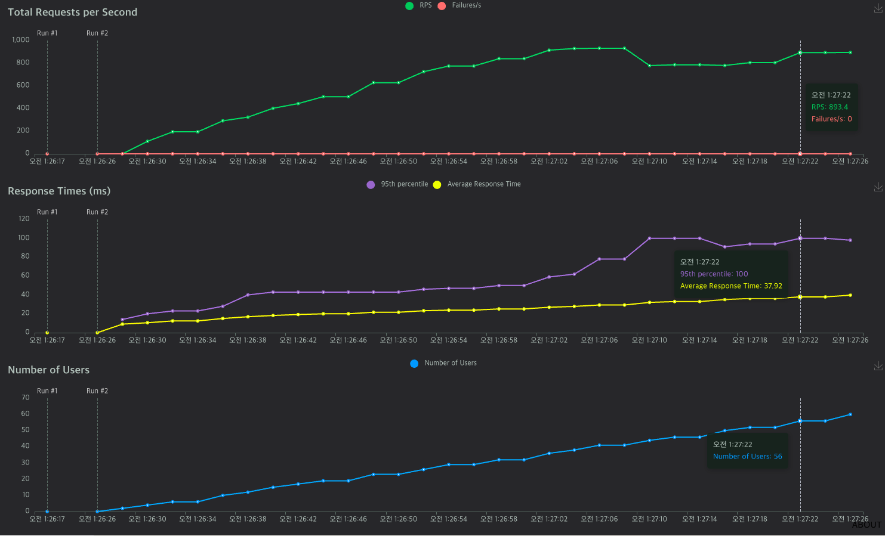

## 백엔드 작업 예시 레포지토리 

### 목적 

데브위키 개발에서 사용할 도메인 프로젝트 예시입니다 .

아직 회의전이라 ㅎ; 그냥 최근에 제가 공부한 것중에 영양가 좋은거 적어둡니다 ㅎ 

### 주요 포인트

##### 1. 멀티모듈 
   - 서비스 전체는 gateway, pipeline, api 서버 , search 서버등으로 구성될 예정입니다.
   - 모놀리식을 여러개 두는 것으로는 감당이 안되기 때문에 멀티모듈을 기본으로 사용합니다.

##### 2. 테스트 가능한 인터페이스 구성
   - 가능하면 아래 기준에 대해선 interface 를 분리하여 테스트 시, fake 객체를 만들 수 있게 설계합니다.
     1. dao, service, presentation 등 레이어간 분리
     2. 하나의 도메인 객체를 여러개의 테이블에서 aggregate해서 만들 때, port 인터페이스를 호출하여 가져옴
        (필수는 아님)
        (예시 : /core/article/domain/port)
     3. jpa repository 를 직접 호출하지 않기 ( fake 객체 생성을 위한 테스트 가능한 코드 만들기 )
        
        4. (예시 : /core/article/repository & /core/article/domain/port)

##### 3. 도메인별 레이어드한 구조 
- hexagonal 한 구조는 보일러 플레이트 코드가 너무 많고 aggregate 하는 부분만 포트 영역에 따로 작성함으로써 비슷한 효과를 가져올 수 있을 것이라 판단.

##### 4. locust
-    성능에 확신이 안든다면 locust 실행하기 
- 우리 서비스에서 distributed lock 이랑 캐싱이랑 엄청 많이 쓸겁니다.
- 테스트 하면서 기록으로 남겨두면 나중에 판단의 지표로 사용할 수 있어요.
- 저는 Locust/ 하위에 다 기록해 놓으려구요.

##### 5. Mock 보다는 fake 객체 사용 

### 그 이외에 추천 사항들 ?

지금 게시판 종류마다 칼럼이 조금씩 다르고, 달리는 댓글의 정책이 조금씩 다를 예정이라 
strategy pattern 을 사용해보는 연습을 해보는 것도 좋을것 같아요 ; 

### 테스트는 fake 객체 사용 

mock 하면 단순 파라미터 작업도 많아지고, 이게 진짜 수행 상황을 대표하는가
(내가 파라미터 넣고 내가 결과값도 넣음 ... )

이런 의문이 있어서 fake 객체를 써보려 합니다. 

하지만 귀찮으면 거시적인 관점에서 통합테스트만 만들어도 좋다고 생각해요 .

### locust 예시

locust/article 경로에서 수행한 결과 파일입니다. 되게 쉬워서 좋았음 .

